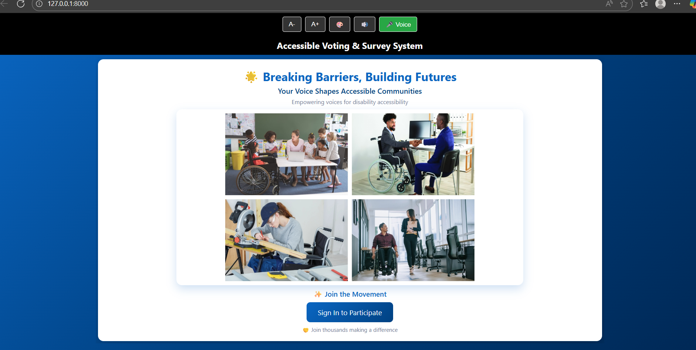
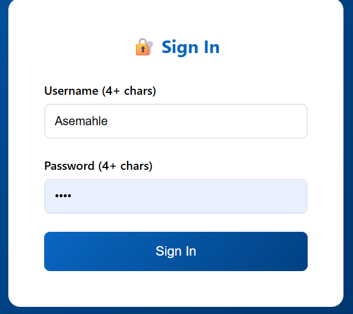
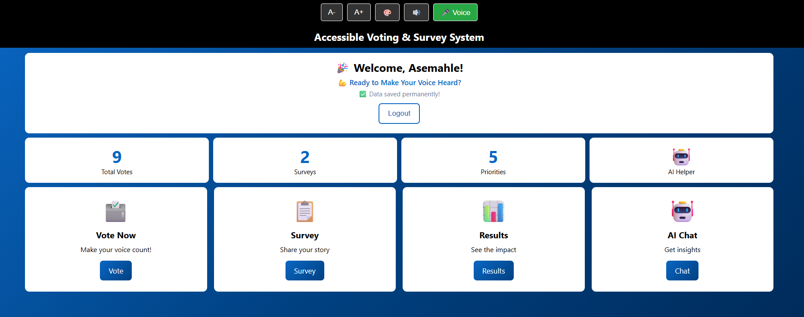
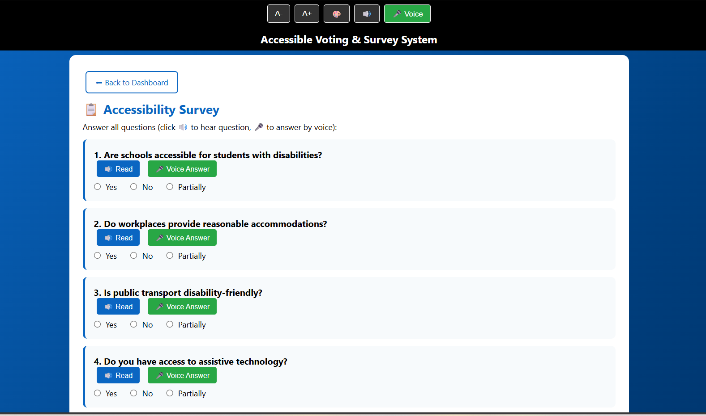
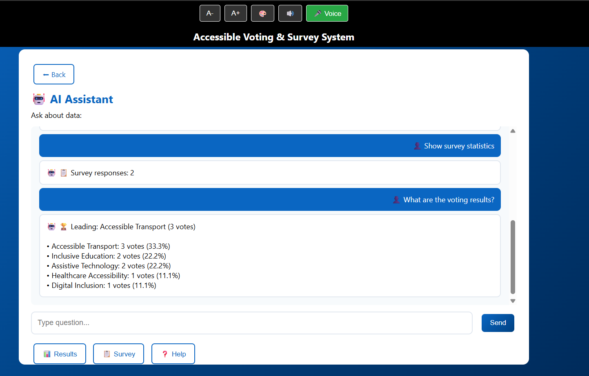

# 🚀 Accessible Voting & Survey System

A fully accessible web application built to empower voices in disability accessibility advocacy. This Django-based system features voice-activated voting, text-to-speech capabilities, and a user-friendly interface designed with accessibility at its core.

## ✨ Features

### Accessibility Features
- **Voice-Activated Voting**: Say "vote for option 1" and cast your vote hands-free
- **Text-to-Speech**: Screen reader support with voice feedback
- **High Contrast Mode**: Enhanced visibility for users with visual impairments
- **Adjustable Font Sizes**: Scalable text for better readability
- **Keyboard Navigation**: Full keyboard accessibility throughout the application

### Core Functionality
- **Secure Authentication**: User login with token-based security
- **Vote Casting**: Vote for accessibility priorities (Transport, Education, Technology, Healthcare, Digital Inclusion)
- **Survey System**: 10-question accessibility survey with voice input option
- **Live Results**: Real-time voting and survey statistics
- **AI Chat Assistant**: Interactive chatbot for querying results
- **Persistent Storage**: All data saved permanently in JSON format

## 🛠️ Tech Stack

- **Backend**: Python with Django framework
- **Frontend**: HTML5, CSS3, JavaScript
- **APIs**: RESTful API endpoints
- **Voice Recognition**: Web Speech API
- **Data Storage**: JSON-based persistent storage
- **Authentication**: Token-based auth system

## 📸 Screenshots

### Welcome Page

*Landing page with accessibility features and call to action*

### Sign In

*Simple and accessible login interface*

### Dashboard

*User dashboard showing vote counts, surveys, and quick access to features*

### Accessibility Survey

*Survey page with voice input and text-to-speech capabilities*

### AI Chat Assistant

*Interactive chatbot providing voting statistics and insights*

### Code Structure

*Clean, well-organized Django application code*

## 📋 Prerequisites

- Python 3.7 or higher
- Django 3.2 or higher
- Modern web browser (Chrome recommended for voice features)

## 🚀 Installation

1. **Clone the repository**
```bash
git clone https://github.com/yourusername/accessible-voting-system.git
cd accessible-voting-system
```

2. **Install Django**
```bash
pip install django
```

3. **Run the application**
```bash
python accessible_voting_system.py runserver
```

4. **Open in browser**
```
http://127.0.0.1:8000
```

## 📖 Usage

### Getting Started
1. Navigate to the home page
2. Click "Sign In to Participate"
3. Create an account (username and password must be 4+ characters)
4. Access the dashboard

### Casting a Vote
- Click on "Vote Now" from the dashboard
- Select your priority or use voice command
- Your vote is saved permanently

### Taking the Survey
- Click on "Survey" from the dashboard
- Answer all 10 questions
- Use 🔊 button to hear questions read aloud
- Use 🎤 button to answer by voice
- Submit your responses

### Viewing Results
- Click on "Results" to see live voting and survey statistics
- Data updates in real-time

### Using the AI Chat
- Click on "AI Chat" from the dashboard
- Ask questions about voting results or survey statistics
- Get instant responses

## 🎯 Accessibility Toolbar

Every page includes an accessibility toolbar with:
- **A-** / **A+**: Decrease/Increase text size
- **🎨**: Toggle high contrast mode
- **🔊**: Enable voice reader
- **🎤**: Voice voting

## 🗂️ Project Structure

```
accessible-voting-system/
├── accessible_voting_system.py    # Main application file
├── voting_data.json               # Persistent data storage (auto-generated)
├── README.md                      # Project documentation
├── LICENSE                        # MIT License
└── .gitignore                     # Git ignore file
```

## 🔐 Security Note

This is a demonstration project. For production use:
- Change the `SECRET_KEY` in Django settings
- Implement proper password hashing
- Use a production-grade database (PostgreSQL, MySQL)
- Add HTTPS support
- Implement rate limiting
- Add CSRF protection for all forms

## 🤝 Contributing

This was a group capstone project for GirlCode. Contributions, issues, and feature requests are welcome!

1. Fork the project
2. Create your feature branch (`git checkout -b feature/AmazingFeature`)
3. Commit your changes (`git commit -m 'Add some AmazingFeature'`)
4. Push to the branch (`git push origin feature/AmazingFeature`)
5. Open a Pull Request

## 📝 License

This project is licensed under the MIT License - see the LICENSE file for details.

## 👥 Team

Built with ❤️ by the GirlCode team as our final capstone project.

## 🙏 Acknowledgments

- **GirlCode** for the amazing program and support
- **Accenture** for sponsoring the bootcamp
- Our teammates for the incredible collaboration and late-night debugging sessions

## 📧 Contact

For questions or feedback, feel free to reach out or open an issue on GitHub.

---

**Made with accessibility in mind. Building tech that makes a difference.** 🌟
